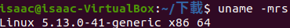
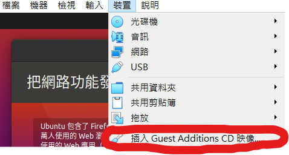
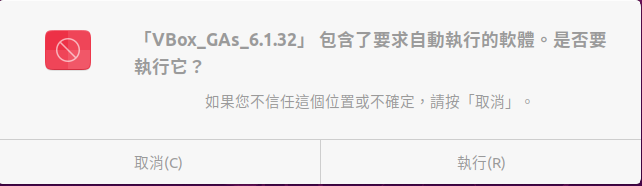
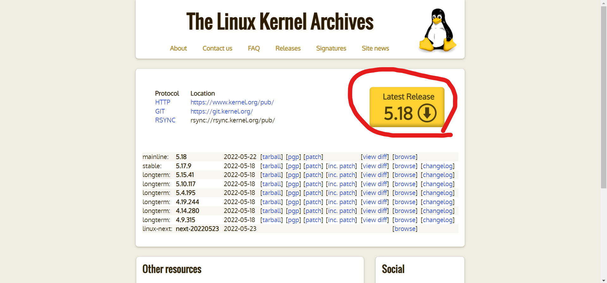
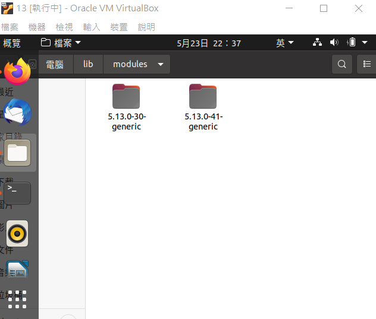
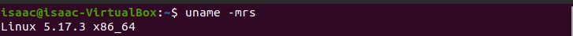
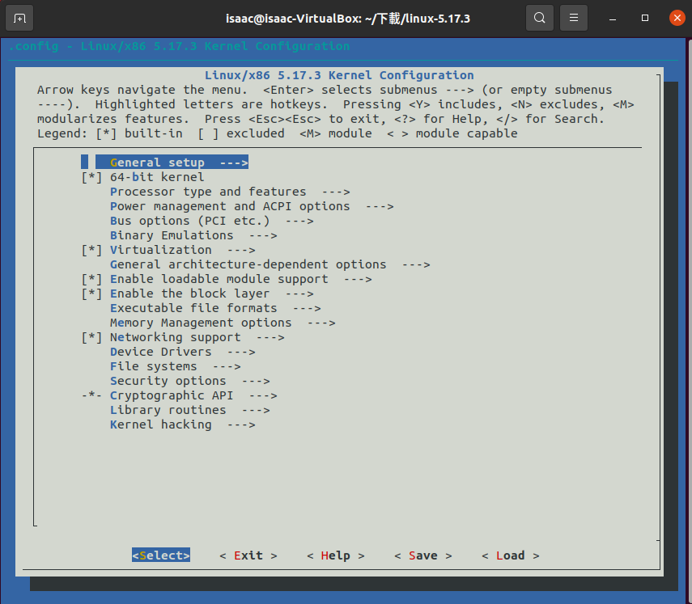

# KRENEL-REBUILD

* [KERNEL-REBUILD 前置作業](#kernel-rebuild-前置作業)
    - [設定記憶體大小](#設定記憶體大小)
    - [確認目前內核版本](#確認目前內核版本)
    - [安裝GUESS-ADDITIONS-CD-映像](#安裝GUESS-ADDITIONS-CD-映像)
       - [步驟一](#步驟一)
       - [步驟二](#步驟二)
    - [安裝gcc等編譯器](#安裝gcc等編譯器)
    - [安裝額外DLC](#安裝額外DLC)
        - [zstd](#zstd)
        - [dwarves](#dwarves)
* [開始安裝](#開始安裝)
    - [下載kernel](#下載kernel)
    - [複製config文件](#複製config文件)
    - [修改config文件](#修改config文件)
    - [安裝](#安裝)
    - [安裝(可選)](#安裝(可選))

## KERNEL-REBUILD 前置作業
### 設定記憶體大小
- 由於REBUILD的檔案相當大,經反覆測試後50GB為最佳的記憶體大小

### 確認目前內核版本
- 若是下載的kernel比目前所使用的版本還舊的話,即使安裝完畢,系統仍會顯示舊的kernel,例如在UBUNTU20.4(內核為5.13.40)上安裝內核5.9.6,最後顯示的仍是5.13.0-41

- 為避免上述的問題,會需要用到uname –mrs進行確認

      

### 安裝GUESS ADDITIONS CD 映像
由於基礎視窗過小,所以如果是有需要進行Mesunconfig的需求的話會無法執行,故需要利用GAC來使視窗大小改變

#### 步驟一
在介面上方找到"裝置",點擊他並找到"插入GAC映像"
    


點選後會跑出以下圖示,點"執行"後系統會自行跳出終端並安裝,結束後按ENTER即跳出視窗



#### 步驟二
結束之後打開終端,並執行以下指令

```shell
sudo apt-get apdate
```

```shell
sudo apt-get apgrade
```

```shell
sudo apt-get install dkms
```
上述動作結束後重開機,並在上方欄位"檢視"中找到選項"自動調整客體顯示大小",即可調節視窗大小

### 安裝gcc等編譯器
安裝gcc等編譯器使能使用make相關的指令

```shell
sudo apt-get install build-essential gcc bc bison flex libssl-dev libncurses5-dev libelf-dev
```
其中gcc 是 c 編譯器 flebx 是詞法分析器，bison 是解析器。

### 安裝額外DLC

這部分是在REBUILD中會遭遇的BUG,為防止過度使用記憶體,所以建議先裝好,若是使用18.04或16.04可跳過
#### zstd

會遇到的問題如下
```shell
/bin/sh: 1: zstd: not found
make[2]: * [arch/x86/boot/compressed/Makefile:139：arch/x86/boot/compressed/vmlinux.bin.zst] 錯誤 127
make[2]: * 正在刪除檔案「arch/x86/boot/compressed/vmlinux.bin.zst」
make[1]: * [arch/x86/boot/Makefile:115：arch/x86/boot/compressed/vmlinux] 錯誤 2
make: * [arch/x86/Makefile:269：bzImage] 錯誤 2
```

須執行以下指令
```shell
sudo apt install zstd
```
#### dwarves

會遇到的問題如下
```shell
BTF: .tmp_vmlinux.btf: pahole (pahole) is not available
Failed to generate BTF for vmlinux
Try to disable CONFIG_DEBUG_INFO_BTF
make: *** [Makefile:1106: vmlinux] Error 1
```

須執行以下指令
```shell
sudo apt install dwarves
```
## 開始安裝
### 下載kernel
分為兩種方法

- 網站下載

前往 www.kernel.org 並點選最新發布的kernel

下載完後檔案會存在"下載"中
- 終端下載

在終端輸入以下指令
```shell
wget https://cdn.kernel.org/pub/linux/kernel/v5.x/linux-需要的版本.tar.xz
```

下載完後檔案會存在"桌面"中

### 複製config文件
在開始製作內核之前,我們需要先複製.config文件來提供對各種硬件的支持。

方法有三種

第一種是
```shell
cp /boot/config-$(uname -r) ./. config
```
但上述這個方法有時候系統會產生未知的錯誤,使其無法正常運作

第二種為
```shell
make localmodconfig
```
輸入後會跑出一系列問題,按ENTER鍵到底即可,若是第一,三種方法則是會在MAKE階段才詢問

第三種就是直接跑到電腦內部直接複製.config文件,需要注意的是20.04是雙核心,所以要確定哪個才是需要複製的


### 修改config文件
20.04中config_system_[trusted_keys,sig_key,revocation_key]這三樣的憑證開啟於debain資料夾中,但實際上debain資料夾是在make途中才創建,所以在跑make的時候一定會出錯
所以需要修改新的位子使其能夠正常運作
```properties
CONFIG_MODULE_SIG_KEY="debian/canonical-certs.pem"
CONFIG_SYSTEM_TRUSTED_KEYS="debian/canonical-certs.pem"
CONFIG_SYSTEM_REVOCATION_KEYS="debian/canonical-revoked-certs.pem"
```
經測試,revocation為非必要憑證,所以僅需要將它那一行改成" "即可
至於trusted_keys,sig_key則可使用同一個憑證,所以修改結果為

```properties
CONFIG_MODULE_SIG_KEY="certs/signing_key.pem"
CONFIG_SYSTEM_TRUSTED_KEYS="certs/signing_key.pem"
CONFIG_SYSTEM_REVOCATION_KEYS=" "
```
至於為何trusted_keys和sig_key不可以像revocation_keys一樣空白
是因為後面會有一文件叫anti.ko,他若沒有上兩位的授權證明,會無法安裝在ubuntu上

### 創造憑證
上一點說到憑證,但目前certs資料夾內是沒有signing_key.pem這個授權文件的,所以需要自己創造,具體指令如下
```shell
sudo tee x509.genkey > /dev/null << 'EOF'
[ req ]
default_bits = 4096
distinguished_name = req_distinguished_name
prompt = no
string_mask = utf8only
x509_extensions = myexts
[ req_distinguished_name ]
CN = Modules
[ myexts ]
basicConstraints=critical,CA:FALSE
keyUsage=digitalSignature
subjectKeyIdentifier=hash
authorityKeyIdentifier=keyid
EOF

sudo openssl req -new -nodes -utf8 -sha512 -days 36500 -batch -x509 -config x509.genkey -outform DER -out signing_key.x509 -keyout signing_key.pem
```
由於是sudo創建的,之後的make就必須加上sudo了

### 安裝
請依序打入下列指令
```shell
sudo make
```
這個流程沒意外會花費5小時左右

```shell
sudo make modules_install
```
```shell
sudo make install 
```
這兩個流程很快,莫約3分鐘左右
結束後請重開機,再輸入uname -mrs即可看到內核改變


### 安裝(可選)
menuconfig是讓你選擇你需要額外改裝內核的什麼東西,但如果你不是內行的真的可以跳過,雖說有簡介,但看完一區就要耗費2小時

指令
```shell
make menuconfig
```
輸入後等他跑一下即會跳出下列畫面


接下來就選自己想改造的部分了
我涉略不深所以我是直接make拉
感謝各位觀看
